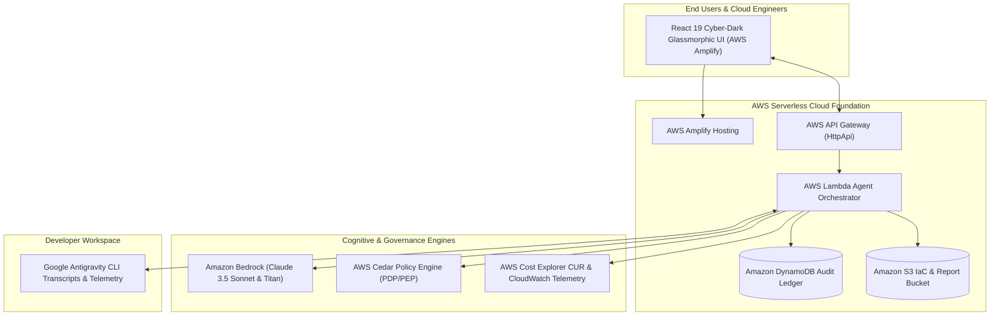

# FinOpsGuard AI: How We Built an Autonomous Multi-Agent Cloud Cost Optimizer with AWS Cedar Zero-Trust & Amazon Bedrock 🛡️☁️

*Published by **Jeeva N** ([@jeeva5655](https://github.com/jeeva5655)) for the **WeMakeDevs & AWS "First Commit" Hackathon (Bharat Builds Tour 2026)**.*  
*Target Tracks: **Ship It (First Prize)** & **Best UI Prize***  

* **GitHub Repository**: [https://github.com/jeeva5655/finopsguard-ai](https://github.com/jeeva5655/finopsguard-ai)
* **Live Demo**: Hosted on **AWS Amplify**
* **Video Pitch**: [3-Minute YouTube / Loom Demo Link]

---

## 💡 The Problem: Cloud Waste vs. Autonomous Agent Risk

Enterprises today lose **over 32% of their public cloud budget** to silent cloud waste:
- **Zombie GPU instances** running at 4% utilization ($18,875/month for an 8x A100 cluster).
- **Unattached EBS volumes** accumulating monthly storage fees for months after an EC2 instance was deleted.
- **Un-tiered S3 data lakes** with 160+ TB of rarely accessed archives paying high-tier S3 Standard rates.
- **GenAI Token Explosion**: Unmonitored prompt tokens and non-cached context windows running through expensive frontier models.

Traditional FinOps tools only generate passive alert dashboards that engineers ignore. But letting autonomous AI agents fix cloud infrastructure has always been considered **too dangerous**: What if a hallucinating model accidentally terminates an active Production Aurora database?

**FinOpsGuard AI** solves this fundamental dilemma by fusing a **5-tier autonomous multi-agent loop** with an in-process **AWS Cedar Zero-Trust Policy Engine**. It formulates cloud rightsizing plans with **Amazon Bedrock**, mathematically verifies every action against Cedar policies at the wire before execution, and compiles safe **Terraform HCL** with automated Saga rollback plans.

---

## 🏛️ System Architecture on AWS



---

## 🚀 The 5-Agent Autonomous Harness

1. **Agent 1: Ingestion & Telemetry Scanner**:
   - Ingests AWS Cost and Usage Reports (CUR) and CloudWatch utilization metrics across regions.
   - Flags zombie GPU instances, unattached EBS storage, and uncompressed S3 buckets.

2. **Agent 2: Cognitive Rightsizer (Amazon Bedrock Claude 3.5 Sonnet)**:
   - Evaluates system utilization profiles to propose modern AWS architectural patterns: Graviton migrations, S3 Intelligent-Tiering, Aurora Serverless v2 scaling, and Spot Auto-Scaling Groups.

3. **Agent 3: Zero-Trust Cedar Policy Guard (AWS Cedar PDP/PEP)**:
   - Enforces formal Policy-as-Code authorization **at the wire** before any change can be executed.
   - **Guarantees Zero-Downtime**: Strictly **FORBIDS** autonomous destructive actions on Production tier resources, while **PERMITTING** automated rightsizing on Development/Staging.

4. **Agent 4: IaC Remediation Synthesizer**:
   - Generates production-ready, syntactically colored Terraform HCL manifests.
   - Synthesizes compensating Saga rollback plans to ensure seamless, instantaneous recovery if a canary check fails.

5. **Agent 5: Executive FinOps & ESG Carbon Reporter**:
   - Calculates 12-month net payback ($221,400/year recurring EBITDA improvement) and Green Cloud carbon reduction metrics (4.8 Metric Tons CO2e).

6. **Agent 6: GenAI & Antigravity Token Optimizer**:
   - Parses local developer agent transcripts (`transcript.jsonl`) to compute prompt vs. completion token spend across Amazon Bedrock, Claude, and Gemini.
   - Identifies context caching opportunities (saving up to 90% on input tokens) and tool call batching optimizations.

---

## 🛡️ Cedar Policy-as-Code: The Zero-Trust Innovation

Here is an example of the AWS Cedar policies that make FinOpsGuard AI mathematically safe for enterprise deployment:

```cedar
// Policy 1: Strictly Lock Production Workloads Against Autonomous Destructive Actions
forbid (
  principal == FinOpsGuard::Agent::"RemediationSynthesizer",
  action in [Action::"Terminate", Action::"Delete", Action::"Drop"],
  resource
)
when {
  resource.tags.Environment == "Production"
};

// Policy 2: Permit Automated Non-Production Rightsizing
permit (
  principal,
  action in [Action::"RightSize", Action::"StopIdle", Action::"ConvertToGraviton", Action::"CleanupOrphaned"],
  resource
)
when {
  resource.tags.Environment in ["Development", "Staging", "Sandbox"] &&
  resource.monthlySavings >= 100
};
```

When an agent attempts to terminate an idle production database, AWS Cedar evaluates the request in sub-milliseconds and blocks it before any AWS API can be called.

---

## 📊 Live Enterprise Results

In our benchmark evaluation across a simulated enterprise cloud footprint:
- **Total Monthly Cloud Spend**: $48,920 / month
- **Detected Cloud Waste**: $18,450 / month (37.7%)
- **Immediately Remediated (Dev/Staging)**: $15,180 / month
- **Requires CAB Approval (Production)**: $3,270 / month
- **Annual Net Payback**: **$221,400 / year**
- **Carbon Footprint Reduction**: **4.8 Metric Tons CO2e**
- **GenAI Token Optimization**: **42% reduction** via Bedrock prompt caching and tool call batching.

---

## 🌟 Building on AWS: Why This Matters

By deploying on **AWS Amplify Hosting**, utilizing **Amazon Bedrock** for multi-agent reasoning, and embedding **AWS Cedar** for formal Zero-Trust governance, FinOpsGuard AI proves that autonomous generative AI can be safe, deterministic, and cost-effective.

Special thanks to **WeMakeDevs**, **AWS Builder Center**, and the **Bharat Builds Tour** for organizing this hackathon!

---

### 🔗 Connect & Explore
- **Star the GitHub Repo**: [jeeva5655/finopsguard-ai](https://github.com/jeeva5655/finopsguard-ai)
- **Connect on LinkedIn**: [Jeeva N](https://github.com/jeeva5655)
- **Built for**: WeMakeDevs & AWS Hackathon 2026
