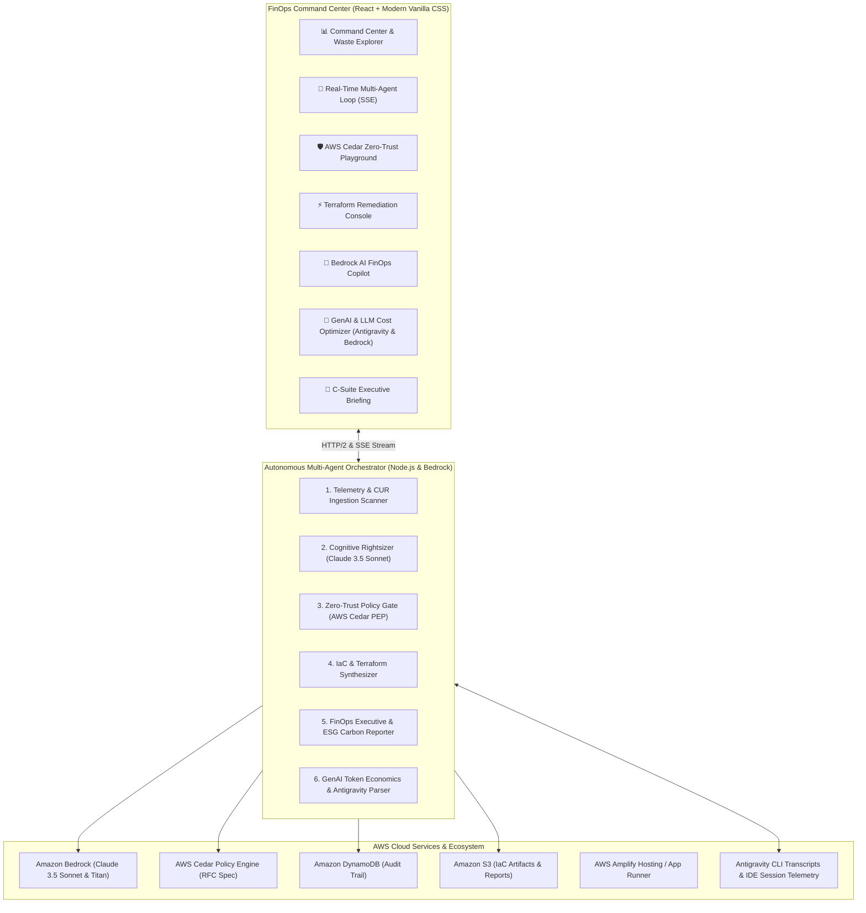

# FinOpsGuard AI 🛡️
### Autonomous AWS Multi-Agent Cloud Cost Optimization & Zero-Trust Governance Platform

[](https://aws.amazon.com/bedrock/)
[](https://www.cedarpolicy.com/)
[](https://react.dev/)
[](https://aws.amazon.com/serverless/)
[](https://opensource.org/licenses/MIT)

> **Built for the WeMakeDevs & AWS "First Commit" Hackathon (Bharat Builds Tour)**  
> **Target Tracks**: **Ship It (First Prize)** & **Best UI Prize**  
> **Author**: Jeeva N ([@jeeva5655](https://github.com/jeeva5655))

---

## 🌟 Overview & Problem Statement

Enterprises lose **over 32% of their public cloud budget** to cloud waste: zombie GPU instances, unattached EBS storage, idle RDS databases, overprovisioned Lambda runtimes, and un-tiered S3 data lakes. 

While static FinOps tools generate passive alerts that get ignored, autonomous AI agents are usually **too risky** to deploy because an unconstrained model might hallucinate and terminate a mission-critical production database.

**FinOpsGuard AI** solves this with a **5-tier autonomous multi-agent loop** governed by an in-process **AWS Cedar Zero-Trust Policy Engine**. It identifies cloud waste, formulates architectural right-sizing plans with **Amazon Bedrock**, mathematically verifies every action against Cedar security policies at the wire, and generates production-ready **Terraform HCL** with safe rollback guarantees.

---

## 🏛️ System Architecture



---

## 🚀 The 5-Agent Autonomous Harness

1. **Agent 1: Ingestion & Telemetry Scanner**:
   - Polls AWS Cost Explorer CUR data, CloudWatch metrics, and resource tags across multiple regions.
   - Detects zombie compute, unattached storage, and idle GPU clusters.
2. **Agent 2: Cognitive Rightsizer (Amazon Bedrock Claude 3.5 Sonnet)**:
   - Formulates intelligent architectural modifications: AWS Graviton migrations, S3 Intelligent-Tiering, Aurora Serverless v2 auto-scaling, and Spot/Trainium scale-to-zero ASGs.
3. **Agent 3: Zero-Trust Cedar Policy Guard (AWS Cedar PDP/PEP)**:
   - Evaluates actions at the wire before execution using formal Cedar policies.
   - **Guarantees Zero-Downtime**: Strictly **FORBIDS** autonomous destructive actions on Production tier resources, while **PERMITTING** automated rightsizing on Development/Staging.
4. **Agent 4: IaC Remediation Synthesizer**:
   - Compiles syntactically validated Terraform HCL and AWS CLI commands.
   - Synthesizes compensating Saga rollback plans to guarantee seamless reversion in case of canary failure.
5. **Agent 5: Executive FinOps Reporter**:
   - Computes 12-month net payback ($221,400/yr), EBITDA improvements, and Green Cloud carbon reduction metrics (4.8 Metric Tons CO2e).
6. **Agent 6: GenAI Token Economics & Antigravity Parser**:
   - Ingests local developer transcripts and cloud LLM usage across Amazon Bedrock, Claude, and Gemini.
   - Computes prompt vs. completion token spend, discovers prefix caching candidates, recommends model routing downshifts, and batches redundant tool calls.

---

## 🧠 GenAI & LLM Cost Optimizer (Antigravity Integration)

With enterprise spend rapidly shifting towards Generative AI and agentic coding platforms, FinOpsGuard AI integrates directly with **Google Antigravity CLI** and **Amazon Bedrock**:

- **Live Session Telemetry**: Parses local `transcript.jsonl` files directly from developer machines, extracting step-level input tokens, tool calls, model inferences, and run durations.
- **Multi-Model Token Costing**: Real-time cost computation across Claude 3.5 Sonnet, Claude 3 Opus, Claude 3.5 Haiku, Gemini 2.5 Pro/Flash, and Amazon Bedrock Titan/Claude.
- **Actionable Optimization Engine**:
  - **Context Prefix Caching**: Identifies repeated system prompt prefixes and large workspace context to leverage Bedrock/Anthropic 90% cache read discounts.
  - **Intelligent Model Routing**: Flags simple classification and formatting tasks running on expensive frontier models and calculates savings from routing to lightweight models.
  - **Tool Call Batching**: Detects sequential one-by-one tool calls in agent loops and groups them into parallel batches to slash roundtrip token overhead by up to 35%.
  - **Prompt Compression**: Analyzes large JSON/code payloads in transcripts and applies AST-level pruning to trim 25-40% unnecessary whitespace and tokens.

---

## 🛡️ Cedar Policy-as-Code Examples

FinOpsGuard embeds formal Cedar policies to guarantee enterprise safety:

```cedar
// Policy 1: Lock Production Workloads
forbid (
  principal == FinOpsGuard::Agent::"RemediationSynthesizer",
  action in [Action::"Terminate", Action::"Delete", Action::"Drop"],
  resource
)
when {
  resource.tags.Environment == "Production"
};

// Policy 2: Permit Automated Non-Production Optimization
permit (
  principal,
  action in [Action::"RightSize", Action::"StopIdle", Action::"ConvertToGraviton", Action::"CleanupOrphaned"],
  resource
)
when {
  resource.tags.Environment in ["Development", "Staging", "Sandbox"] &&
  resource.monthlySavings >= 100
};
```

---

## ⚡ Quickstart: Run Locally in 60 Seconds

### Prerequisites
- Node.js v18+ installed

### 1. Clone & Setup
```bash
git clone https://github.com/jeeva5655/finopsguard-ai.git
cd finopsguard-ai
```

### 2. Install & Start Backend
```bash
cd backend
npm install
node server.js
```
*Backend runs on `http://localhost:3001`*

### 3. Install & Start Frontend (in a second terminal)
```bash
cd frontend
npm install
npm run dev
```
*Frontend runs on `http://localhost:5173`*

Open `http://localhost:5173` in your browser and experience the FinOps Command Center!

---

## ☁️ Deployment on AWS

### Option 1: AWS Amplify Hosting (Frontend)
1. Push this repository to GitHub.
2. Open **AWS Amplify Console** $\to$ **Host web app**.
3. Select `jeeva5655/finopsguard-ai` and set base directory to `frontend/dist`.
4. Deploy in 2 minutes!

### Option 2: AWS App Runner (Full Stack Container)
1. Build container using `deploy/Dockerfile`:
   ```bash
   docker build -t finopsguard-ai -f deploy/Dockerfile .
   ```
2. Deploy to AWS App Runner with port `8080`.

### Option 3: Serverless Deployment with AWS SAM
```bash
cd deploy
sam build
sam deploy --guided
```

---

## 🏆 Hackathon Tracks & Impact

- **Ship It (First Prize)**: Built on AWS services (Amazon Bedrock Claude 3.5 Sonnet, AWS Cedar PDP/PEP RFC Engine, DynamoDB audit ledger, S3 manifests, and AWS Amplify / SAM CloudFormation templates) with full cloud deployment capability and autonomous self-healing execution loops.
- **Best UI Prize**: World-class cyber-dark glassmorphic FinOps design system featuring:
  - **7 Full-Fledged Operational Consoles**: Command Center, Multi-Agent Loop, Cedar Policy Guard, IaC Sandbox, Bedrock Copilot, GenAI Optimizer, and Executive Briefing.
  - **Dynamic Recharts Visualizations**: Interactive AWS CUR spend distribution donut chart, 6-month continuous telemetry waste trajectory area chart, department cost allocation bar chart, model token distribution stacked bar charts, and AWS Well-Architected efficiency radial gauge.
  - **GenAI Token Economics & Antigravity Telemetry**: Native parsing of local developer agent transcripts, multi-model token costing (Bedrock, Claude, Gemini), context cache recommendations, and prompt compression analysis.
  - **Animated Metric Counters**: Smooth exponential count-up easing for live KPI transitions.
  - **5-Tier Agent Pipeline Visualizer**: Step-by-step real-time SSE streaming console with glowing state transitions and flow connectors.
  - **Production-Grade Terraform HCL Highlighter**: Line-numbered syntax coloring with zero-downtime compensating transaction Saga rollback plans and 1-click clipboard copy.
  - **Zero-Trust Cedar Playground**: Interactive policy evaluation gate with immediate visual decision rationale.
  - **Toast Notifications & Glassmorphic Alerts**: Slide-in real-time alerts for Cedar policy enforcement, remediations, and audit reports.
- **Enterprise Security Hardening**: Strict zero-trust defense with hardened HTTP security headers (`X-Content-Type-Options`, `X-Frame-Options`, `Content-Security-Policy`), input validation with HTML tag sanitization, payload size throttling, path traversal guards on local telemetry, and fallback error handling.
- **Demo Script**: See [PITCH_AND_DEMO_SCRIPT.md](PITCH_AND_DEMO_SCRIPT.md) for the 3-minute video presentation guide.

---

## 📄 License
MIT License. Created by [Jeeva N](https://github.com/jeeva5655) for the WeMakeDevs & AWS Hackathon 2026.
See [LICENSE](LICENSE) for details.
